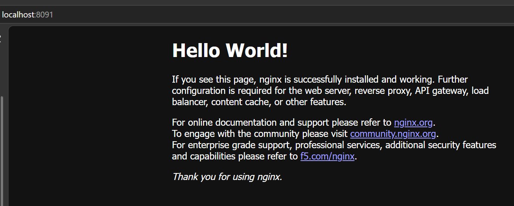
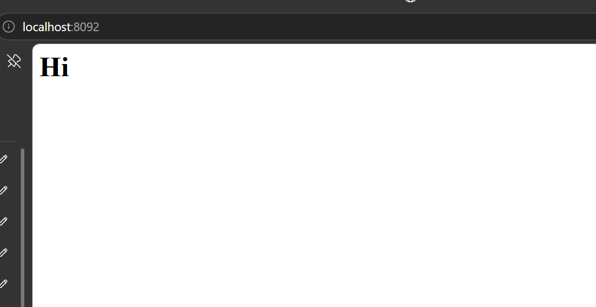
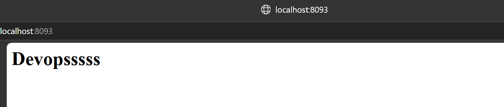

# 5주차-Docker
-[x] `docker --version` 정상출력
-[x] `docker run hello-world` 실행
-[x] `web`이라는이름으로nginx 컨테이너실행
-[x] 브라우저또는`curl`로`http://localhost:8080` 응답확인
-[x] `docker ps`에서실행상태를확인
-[x] 실습결과를`week05/README.md`에기록
-[ ] 수업에서만든컨테이너정리
-[ ] 혼자서해보기완
## 혼자서 해보기: nginx 3개 실행

### curl 확인 결과

`curl http://localhost:8091`
```
<!DOCTYPE html>
<html>
<head>
<title>Hello World!</title>
<style>
html { color-scheme: light dark; }
body { width: 35em; margin: 0 auto;
font-family: Tahoma, Verdana, Arial, sans-serif; }
</style>
</head>
<body>
<h1>Hello World!</h1>
<p>If you see this page, nginx is successfully installed and working.
Further configuration is required for the web server, reverse proxy, 
API gateway, load balancer, content cache, or other features.</p>

<p>For online documentation and support please refer to
<a href="https://nginx.org/">nginx.org</a>.<br/>
To engage with the community please visit
<a href="https://community.nginx.org/">community.nginx.org</a>.<br/>
For enterprise grade support, professional services, additional 
security features and capabilities please refer to
<a href="https://f5.com/nginx">f5.com/nginx</a>.</p>

<p><em>Thank you for using nginx.</em></p>
</body>
</html>
```

`curl http://localhost:8092`
```
<h1>Hi</h1>
```

`curl http://localhost:8093`
```
<h1>Devopsssss</h1>
```

### 브라우저 확인 (스크린샷)






cat >> README.md << 'EOF'

